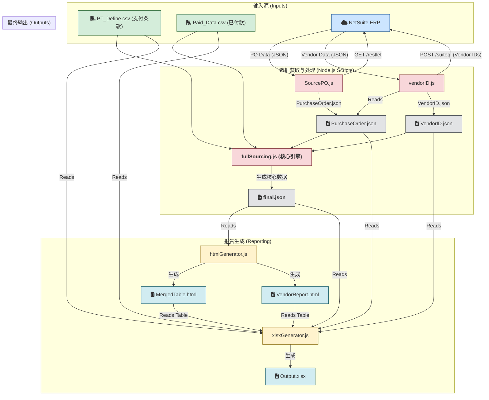

# NetSuite 采购订单分析与报告系统

[](LICENSE)
[](https://github.com/example/repo)
[](package.json)

## 项目简介

本项目是一个自动化的数据处理与报告生成系统，专为财务和采购团队设计。它通过与 NetSuite ERP 系统深度集成，自动化处理采购订单（PO）的付款周期、现金流预测和供应商管理。系统能够拉取原始数据，结合外部的支付条款和已付款数据，经过一系列复杂的计算和逻辑处理，最终生成交互式的 HTML 报告和结构化的 Excel 分析文件，极大地提高了财务分析的效率和准确性。

## 核心功能

*   **自动化数据拉取**: 通过 NetSuite RESTlet 和 SuiteQL API，自动获取最新的采购订单和供应商主数据。
*   **复杂数据处理**:
    *   智能合并来自 NetSuite 的 PO 数据、供应商数据以及外部 CSV 文件（支付条款定义、已付款记录）。
    *   按比例将已付款项分摊到每个 PO 的具体行上。
    *   根据预设的支付条款（如定金、预付款、尾款）和预计到货日期（ERD），精确计算每笔款项的到期日和金额。
*   **动态报告生成**:
    *   生成包含多维度分析的 **HTML 报告**，包括按供应商和月份汇总的付款计划、预算合并分析表，并支持在前端进行简单的交互计算。
    *   生成包含多个工作表的 **Excel (`.xlsx`) 文件**，其中包括原始数据、处理后的明细、以及各类汇总报告，方便离线分析和归档。
*   **配置与扩展**:
    *   通过 `.env` 文件管理 NetSuite API 凭证，保障安全性。
    *   通过独立的 CSV 文件管理支付条款，方便非开发人员更新业务规则。

## 核心流程图



## 技术栈

*   **后端**: Node.js
*   **API 与数据源**:
    *   NetSuite SuiteScript (RESTlet, SuiteQL)
    *   CSV 文件
*   **关键依赖库**:
    *   `follow-redirects`: 用于处理带重定向的 HTTPS 请求。
    *   `oauth-1.0a`: 用于 NetSuite API 的 OAuth 1.0a 认证。
    *   `dotenv`: 用于管理环境变量。
    *   `csv-parser`: 用于高效解析 CSV 文件。
    *   `xlsx`: 用于生成和操作 Excel (`.xlsx`) 文件。
    *   `cheerio`: 用于在服务器端解析和操作 HTML，主要用于从 HTML 报告模板中提取数据。

## 安装与启动

**1. 克隆仓库**
```bash
git clone <your-repository-url>
cd NetsuiteAI
```

**2. 安装依赖**
```bash
npm install
```

**3. 配置环境变量**
在项目根目录下创建一个 `.env` 文件，并填入您的 NetSuite API 凭证：
```env
# NetSuite 账户信息
ACCOUNT_ID="YOUR_NETSUITE_ACCOUNT_ID"

# RESTlet API (用于获取PO数据)
API_HOSTNAME="your-restlet-hostname.restlets.api.netsuite.com"
API_PATH="/app/site/hosting/restlet.nl?script=xxxx&deploy=1"

# SuiteQL API (用于获取Vendor数据)
API_HOSTNAME_SUITETALK="your-suitetalk-hostname.suitetalk.api.netsuite.com"
API_PATH_SUITEQL="/services/rest/query/v1/suiteql"

# OAuth 1.0a 凭证
CONSUMER_KEY="YOUR_CONSUMER_KEY"
CONSUMER_SECRET="YOUR_CONSUMER_SECRET"
TOKEN_ID="YOUR_TOKEN_ID"
TOKEN_SECRET="YOUR_TOKEN_SECRET"
```

**4. 准备数据文件**
将数据文件放入 `private/` 目录下。根据 `src/index.js` 中的配置，您可能需要以下文件：
*   `private/PaymentTerm_define.csv`: 支付条款定义文件。
*   `private/2025May/paidPOMay9.csv`: 已付款记录文件。
*   *（注意：采购订单和供应商数据将由脚本自动从 NetSuite API 获取并存入 `private/` 目录）*

**5. 启动主流程**
执行主脚本来启动完整的数据处理流程：
```bash
node src/index.js
```
执行成功后，最终的报告文件将生成在 `private/` 和 `public/html/` 目录下。

## 使用示例

项目的主入口是 [`src/index.js`](src/index.js)。默认情况下，它会执行完整的 sourcing 流程。

```javascript
// src/index.js

// 生成最终文件
const { processFullSourcing } = require('./services/fullSourcing');

(async () => {
  try {
    // 定义输入文件路径
    const recordFilePath = "private/2025May/PurchaseOrderMay14.json"; // PO数据 (可由SourcePO.js生成)
    const vendorFilePath = "private/VendorID_May_14.json"; // Vendor数据 (可由vendorID.js生成)
    const ptDefineCsvFile = "private/PaymentTerm_define.csv"; // 支付条款定义
    const paidCsvFile = "private/2025May/paidPOMay9.csv"; // 已付款数据

    // 执行核心处理流程
    const finalFilePath = await processFullSourcing(recordFilePath, vendorFilePath, ptDefineCsvFile, paidCsvFile);

    console.log("✅ 所有操作完成！");
    console.log("   Final 文件路径:", finalFilePath);

  } catch (err) {
    console.error('❌ 执行流程出错:', err);
  }
})();
```

您可以根据需要注释或修改 `src/index.js` 来执行不同的子任务，例如仅更新供应商数据或重新生成报告。

## 目录结构

```
.
├── config/                  # 配置文件目录
│   └── config.js
├── node_modules/            # Node.js 依赖
├── private/                 # 存放敏感数据、原始数据和最终生成的报告
├── public/                  # 存放公共资源，如生成的HTML报告
│   └── html/
├── src/                     # 项目核心源代码
│   ├── services/            # 核心业务逻辑服务
│   │   ├── fullSourcing.js  # 数据合并与计算核心模块
│   │   ├── SourcePO.js      # 从NetSuite API获取采购订单数据
│   │   └── vendorID.js      # 从NetSuite API获取供应商数据
│   ├── utils/               # 辅助工具和脚本
│   │   ├── htmlGenerator.js # 生成HTML报告
│   │   ├── netsuite_GetSearch.js # (部署在NetSuite端) RESTlet脚本
│   │   ├── xlsxGenerator.js # 生成Excel报告
│   │   └── xlsxToJson.js    # (推断) 从Excel转换到JSON
│   └── index.js             # 项目主入口文件
├── .env.example             # 环境变量示例文件
├── .gitignore               # Git忽略配置
├── package.json             # 项目依赖和脚本定义
├── package-lock.json        # 依赖版本锁定
└── README.md                # 项目说明文档