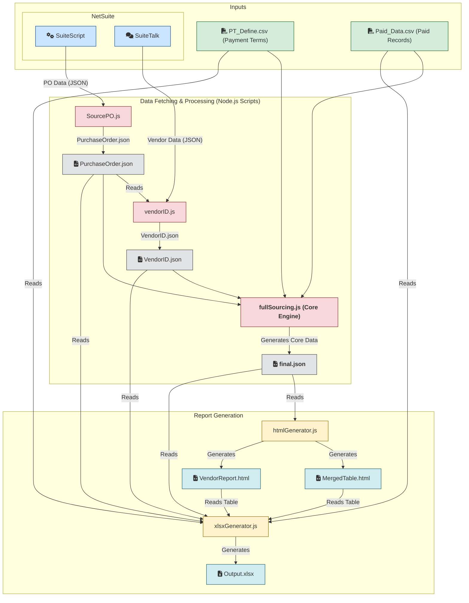

# NetSuite Purchase Order Analysis and Reporting System

[](LICENSE)
[](https://github.com/example/repo)
[](package.json)

## Introduction

This project is an automated data processing and report generation system designed for finance and procurement teams. Through deep integration with the NetSuite ERP system, it automates the handling of purchase order (PO) payment cycles, cash flow forecasting, and vendor management. The system pulls raw data, combines it with external payment terms and payment records, and after a series of complex calculations and logical processing, generates interactive HTML reports and structured Excel analysis files, significantly improving the efficiency and accuracy of financial analysis.

## Core Features

*   **Automated Data Retrieval**: Automatically fetches the latest purchase order and vendor master data via NetSuite RESTlet and SuiteQL APIs.
*   **Complex Data Processing**:
    *   Intelligently merges PO data, vendor data from NetSuite, and external CSV files (payment term definitions, payment records).
    *   Prorates paid amounts across individual PO lines.
    *   Accurately calculates the due date and amount for each payment installment (e.g., deposit, prepayment, balance) based on predefined payment terms and the Estimated Ready Date (ERD).
*   **Dynamic Report Generation**:
    *   Generates multi-dimensional **HTML reports**, including payment schedules aggregated by vendor and month, and a consolidated budget analysis table with support for basic front-end interactions.
    *   Creates multi-sheet **Excel (`.xlsx`) files** containing raw data, processed details, and various summary reports for offline analysis and archiving.
*   **Configuration and Extensibility**:
    *   Manages NetSuite API credentials securely via a `.env` file.
    *   Manages payment terms through a separate CSV file, allowing non-developers to easily update business rules.

## Core Workflow



## Tech Stack

*   **Backend**: Node.js
*   **APIs & Data Sources**:
    *   NetSuite SuiteScript (RESTlet, SuiteQL)
    *   CSV Files
*   **Key Dependencies**:
    *   `follow-redirects`: For handling HTTPS requests with redirects.
    *   `oauth-1.0a`: For NetSuite API OAuth 1.0a authentication.
    *   `dotenv`: For managing environment variables.
    *   `csv-parser`: For efficient CSV file parsing.
    *   `xlsx`: For generating and manipulating Excel (`.xlsx`) files.
    *   `cheerio`: For server-side HTML parsing and manipulation, mainly used to extract data from HTML report templates.

## Installation and Setup

**1. Clone the Repository**
```bash
git clone https://github.com/lennonkc/NetsuiteAI
cd NetsuiteAI
```

**2. Install Dependencies**
```bash
npm install
```

**3. Configure Environment Variables**
Create a `.env` file in the project root and fill in your NetSuite API credentials:
```env
# NetSuite Account Info
ACCOUNT_ID="YOUR_NETSUITE_ACCOUNT_ID"

# RESTlet API (for fetching PO data)
API_HOSTNAME="your-restlet-hostname.restlets.api.netsuite.com"
API_PATH="/app/site/hosting/restlet.nl?script=xxxx&deploy=1"

# SuiteQL API (for fetching Vendor data)
API_HOSTNAME_SUITETALK="your-suitetalk-hostname.suitetalk.api.netsuite.com"
API_PATH_SUITEQL="/services/rest/query/v1/suiteql"

# OAuth 1.0a Credentials
CONSUMER_KEY="YOUR_CONSUMER_KEY"
CONSUMER_SECRET="YOUR_CONSUMER_SECRET"
TOKEN_ID="YOUR_TOKEN_ID"
TOKEN_SECRET="YOUR_TOKEN_SECRET"
```

**4. Prepare Data Files**
Place the necessary data files in the `private/` directory. Based on the configuration in `src/index.js`, you may need:
*   `private/PaymentTerm_define.csv`: The payment term definition file.
*   `private/2025May/paidPOMay9.csv`: The payment records file.
*   *(Note: Purchase order and vendor data will be automatically fetched from the NetSuite API and saved to the `private/` directory by the scripts.)*

**5. Run the Main Process**
Execute the main script to start the complete data processing workflow:
```bash
node src/index.js
```
Upon successful execution, the final report files will be generated in the `private/` and `public/html/` directories.

## Usage Example

The main entry point of the project is [`src/index.js`](src/index.js). By default, it runs the full sourcing process.

```javascript
// src/index.js

// Generate the final file
const { processFullSourcing } = require('./services/fullSourcing');

(async () => {
  try {
    // Define input file paths
    const recordFilePath = "private/2025May/PurchaseOrderMay14.json"; // PO data (can be generated by SourcePO.js)
    const vendorFilePath = "private/VendorID_May_14.json"; // Vendor data (can be generated by vendorID.js)
    const ptDefineCsvFile = "private/PaymentTerm_define.csv"; // Payment term definitions
    const paidCsvFile = "private/2025May/paidPOMay9.csv"; // Paid records

    // Execute the core processing workflow
    const finalFilePath = await processFullSourcing(recordFilePath, vendorFilePath, ptDefineCsvFile, paidCsvFile);

    console.log("✅ All operations completed!");
    console.log("   Final file path:", finalFilePath);

  } catch (err) {
    console.error('❌ Error executing the workflow:', err);
  }
})();
```

You can comment out or modify `src/index.js` to run different sub-tasks, such as updating only the vendor data or regenerating reports.

## Directory Structure

```
.
├── config/                  # Configuration files
│   └── config.js
├── node_modules/            # Node.js dependencies
├── private/                 # Stores sensitive data, raw data, and final reports
├── public/                  # Public assets, such as generated HTML reports
│   └── html/
├── src/                     # Core source code
│   ├── services/            # Core business logic services
│   │   ├── fullSourcing.js  # Core module for data merging and calculations
│   │   ├── SourcePO.js      # Fetches PO data from NetSuite API
│   │   └── vendorID.js      # Fetches vendor data from NetSuite API
│   ├── utils/               # Utility scripts and helpers
│   │   ├── htmlGenerator.js # Generates HTML reports
│   │   ├── netsuite_GetSearch.js # RESTlet script (deployed on NetSuite)
│   │   ├── xlsxGenerator.js # Generates Excel reports
│   │   └── xlsxToJson.js    # (Inferred) Converts Excel to JSON
│   └── index.js             # Main entry point of the project
├── .env.example             # Example environment file
├── .gitignore               # Git ignore configuration
├── package.json             # Project dependencies and scripts
├── package-lock.json        # Locked dependency versions
└── README.md                # Project documentation (Chinese)